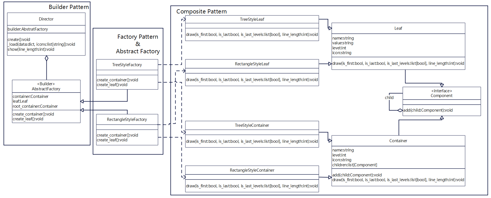
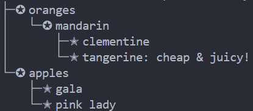
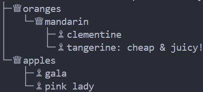
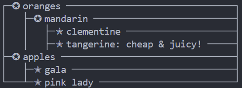
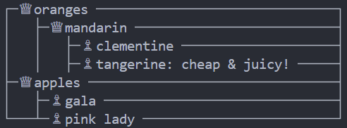

# Funny-JSON-Explorer
Funny JSON Explorer(FJE)，是一个JSON文件可视化的命令行界面小工具。

```
python main.py -f <json file> -s <style> -i <icon family>
```

## 类图


## 设计模式

1. **工厂方法**（Factory）：定义一种创建对象的接口，但将具体实例化对象的工作推迟到子类中完成。在本项目中我使用工厂方法模式的具体地方是AbstractFactory类及其子类TreeStyleFactory和RectangleStyleFactory。首先在抽象工厂AbstractFactory中定义了两个用于创建对象的抽象函数create_container()和create_leaf()，然后在树形风格工厂TreeStyleFactory实现了create_container()函数和create_leaf()函数分别用于创建树形风格的中间节点和树形风格的叶子节点；在矩形风格工厂RectangleStyleFactory中实现了create_container()函数和create_leaf()函数分别用于创建矩形风格的中间节点和矩形风格的叶子节点。这样的话Director类使用工厂来创建对象时并不直接依赖于具体的类名，而且当需要更改具体的实现时，只需替换工厂的子类，而无需修改Director类的代码。

2. **抽象工厂**（Abstract Factory）：创建一系列相关的对象，而无需指定其具体类。在本项目中AbstractFactory是抽象工厂接口，TreeStyleFactory和RectangleStyleFactory是具体的抽象工厂，它们一起实现了抽象工厂。抽象工厂模式可以创建一系列相关或依赖的产品，这些产品组成了一个产品族，在这里树形风格工厂和矩形风格工厂分别创建了树形风格和矩形风格的中间节点和叶子节点，这些产品组成了两个不同的产品族。

3. **建造者模式**（Builder pattern）：将一个复杂的对象分解为多个简单的对象，然后一步一步构建而成，允许我们使用相同的创建代码生成不同类型和形式的对象。在本项目中AbstractFactory是Builder，而Director指挥Builder进行生产，Director类的create函数用于对不同风格的具体Builder创建中间节点和叶子节点（Director无需关心具体的实现细节，只需调用工厂接口即可），_load函数用于加载处理json数据构成节点的树状结构，show函数用于将json文件可视化，而create_container和create_leaf函数是Builder的部分方法。

4. **组合模式**（Composite pattern)：将对象组合成树状结构以表示部分-整体的层次结构，并且能像使用独立对象一样使用它们。在本项目中组合模式通过定义抽象基类Component使中间节点Container和叶子节点Leaf具有统一的接口。具体实现包括TreeStyleLeaf和RectangleStyleLeaf，以及TreeStyleContainer和RectangleStyleContainer，分别负责不同风格的节点绘制。组合模式允许中间节点和叶子节点递归地组合成树形结构，并通过相同的接口进行操作和绘制，简化了客户端代码的处理。

## 可扩展性

1. 不改变现有代码，只需添加新的抽象工厂，即可添加新的风格：
先在AbstractFactory.py文件中添加新的风格的抽象工厂，然后在Component.py文件中添加新的风格的Leaf类和Contrainer类及其相应的风格的draw函数即可完成添加新的风格。

2. 通过配置文件，可添加新的图标族：
先在config.py文件中添加新的图标族，然后在IconFamily.py中添加相应的索引即可完成添加新的图标族。

## 运行截图

tree+star:<br />

<br />
tree+king:<br />

<br />
rectangle+star:<br />

<br />
rectangle+king:<br />

